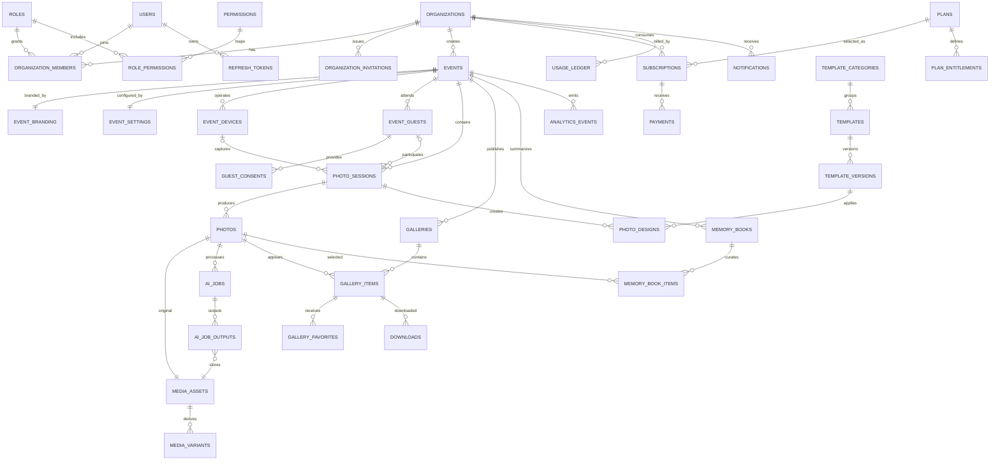

# Database Architecture

## 1. Conventions

- PostgreSQL is the transactional source of truth.
- Primary keys are UUIDs generated application-side or with UUIDv7 support.
- Tenant-owned tables contain a non-null `organization_id`.
- Mutable tables include `created_at_utc`, `updated_at_utc` and a concurrency token.
- Soft deletion is used only where restoration/audit needs justify it; media deletion state is explicit.
- User-facing event URLs use unique slugs, but authorization and relations use IDs.
- Money uses integer minor units plus ISO currency.
- Flexible provider payloads may use `jsonb`; core searchable business attributes remain typed columns.
- Enumerations are stored as stable strings or constrained small integers with application mapping.
- Personally identifiable and consent data has explicit retention classifications.

## 2. Entity Catalog

### Identity and tenancy

| Entity | Important fields |
|---|---|
| `users` | id, email_normalized, email, password_hash, display_name, email_verified_at, status, last_login_at |
| `refresh_tokens` | id, user_id, token_hash, family_id, expires_at, revoked_at, replaced_by_id, created_ip |
| `email_verification_tokens` | id, user_id, token_hash, expires_at, consumed_at |
| `password_reset_tokens` | id, user_id, token_hash, expires_at, consumed_at |
| `organizations` | id, name, slug, status, timezone, owner_user_id, settings_json |
| `organization_members` | id, organization_id, user_id, role_id, status, joined_at |
| `organization_invitations` | id, organization_id, email, role_id, token_hash, invited_by, expires_at, accepted_at |
| `roles` | id, code, scope (`platform`/`organization`), name, is_system |
| `permissions` | id, code, description |
| `role_permissions` | role_id, permission_id |

System role codes:

- `super_admin`
- `organization_owner`
- `event_manager`
- `photographer`
- `guest`

Guest gallery access should not automatically create an organization member. The Guest role is reserved for authenticated guest capabilities where needed.

### Billing and entitlements

| Entity | Important fields |
|---|---|
| `plans` | id, code, name, billing_interval, price_minor, currency, is_active |
| `plan_entitlements` | plan_id, feature_code, limit_value, configuration_json |
| `subscriptions` | id, organization_id, plan_id, provider, provider_customer_id, provider_subscription_id, status, period_start, period_end |
| `usage_ledger` | id, organization_id, event_id, feature_code, quantity, reservation_key, status, occurred_at |
| `payments` | id, organization_id, subscription_id, provider_payment_id, amount_minor, currency, status, paid_at |
| `billing_webhook_receipts` | id, provider, external_event_id, payload_hash, received_at, processed_at, status |

Usage is append-only. Current consumption is derived or aggregated; limits are never enforced only from a client-side counter.

### Events and branding

| Entity | Important fields |
|---|---|
| `events` | id, organization_id, name, slug, event_type, starts_at_utc, ends_at_utc, timezone, venue, status, privacy |
| `event_branding` | event_id, logo_media_id, primary_color, secondary_color, font_family, custom_css_policy |
| `event_settings` | event_id, capture_modes_json, countdown_seconds, burst_count, moderation_mode, retention_days |
| `event_devices` | id, event_id, name, device_key_hash, platform, last_seen_at, status |

`UNIQUE (organization_id, slug)` is required. A global public URL may use a globally unique published slug or an organization slug plus event slug.

### Guests and CRM

| Entity | Important fields |
|---|---|
| `event_guests` | id, organization_id, event_id, name, email_encrypted, phone_encrypted, source, first_seen_at |
| `guest_consents` | id, guest_id, consent_type, policy_version, granted, captured_at, capture_source, evidence_json |
| `guest_feedback` | id, guest_id, event_id, rating, message, submitted_at |
| `campaigns` | id, organization_id, event_id, name, channel, status, scheduled_at, template_json |
| `campaign_recipients` | campaign_id, guest_id, delivery_status, provider_message_id, sent_at |

Marketing consent and event/photo release consent are distinct.

### Capture and media

| Entity | Important fields |
|---|---|
| `photo_sessions` | id, organization_id, event_id, guest_id, device_id, mode, started_at, completed_at, status |
| `photos` | id, organization_id, event_id, session_id, original_asset_id, status, captured_at, moderation_status |
| `media_assets` | id, organization_id, storage_provider, bucket, object_key, mime_type, size_bytes, checksum, width, height, duration_ms, state |
| `media_variants` | id, media_asset_id, source_variant_id, variant_type, object_key, transform_json, width, height, created_at |
| `capture_items` | id, session_id, photo_id, sequence_number, capture_metadata_json |

`media_assets.object_key` is unique within provider/bucket. Public URLs are generated at delivery time.

### Templates and design

| Entity | Important fields |
|---|---|
| `template_categories` | id, organization_id nullable, name, slug, sort_order |
| `templates` | id, organization_id nullable, category_id, name, type, status, current_version_id, marketplace_state |
| `template_versions` | id, template_id, version, canvas_width, canvas_height, document_json, preview_asset_id, published_at |
| `stickers` | id, organization_id nullable, category_id, name, media_asset_id, metadata_json, status |
| `photo_designs` | id, organization_id, event_id, session_id, template_version_id, document_json, rendered_asset_id |

Global marketplace resources have `organization_id = NULL`; tenant resources require it. Published template versions are immutable.

### AI and memory books

| Entity | Important fields |
|---|---|
| `ai_jobs` | id, organization_id, event_id, photo_id, operation, provider, model, parameters_json, status, idempotency_key, cost_minor, error_code |
| `ai_job_outputs` | id, ai_job_id, media_asset_id, output_type, safety_json |
| `memory_books` | id, organization_id, event_id, title, status, story_text, cover_asset_id, output_asset_id |
| `memory_book_items` | id, memory_book_id, photo_id, rank, chapter, caption, selection_reason_json |
| `montage_jobs` | id, memory_book_id, status, parameters_json, output_asset_id |

### Galleries and engagement

| Entity | Important fields |
|---|---|
| `galleries` | id, organization_id, event_id, slug, access_mode, access_code_hash, status, published_at, settings_json |
| `gallery_items` | gallery_id, photo_id, sort_order, visibility, published_at |
| `gallery_favorites` | id, gallery_id, photo_id, guest_id nullable, anonymous_session_hash nullable, created_at |
| `downloads` | id, organization_id, event_id, gallery_id, photo_id, guest_id, format, downloaded_at |
| `shares` | id, organization_id, event_id, gallery_id, photo_id, channel, guest_id, shared_at |

### Analytics and notifications

| Entity | Important fields |
|---|---|
| `analytics_events` | id, organization_id, event_id, event_name, occurred_at, actor_type, actor_id, session_id, properties_json |
| `analytics_daily` | organization_id, event_id, metric_date, metric_code, value, dimensions_hash, dimensions_json |
| `notifications` | id, user_id, organization_id, type, title, body, data_json, read_at, created_at |
| `outbox_messages` | id, occurred_at, type, payload_json, correlation_id, processed_at, attempts, error |
| `audit_log` | id, organization_id, actor_user_id, action, resource_type, resource_id, ip_hash, metadata_json, occurred_at |

## 3. ER Diagram

## 4. Tenant Isolation

Every tenant-owned aggregate carries `organization_id`, including records reachable through an event. This intentional duplication enables:

- simple tenant-scoped indexes;
- fast security predicates;
- safer bulk retention/deletion;
- fewer cross-tenant join risks.

Rules:

1. The authenticated user selects an organization context only from active memberships.
2. Resource authorization verifies that the resource belongs to that organization.
3. Repositories require tenant context for tenant-owned queries.
4. Unique constraints include `organization_id` where uniqueness is tenant-local.
5. Integration tests attempt cross-tenant reads and writes for every endpoint family.
6. PostgreSQL Row-Level Security may be added as defense in depth, but does not replace application authorization.

## 5. Key Indexes

- `users(email_normalized)` unique.
- `organization_members(organization_id, user_id)` unique.
- `events(organization_id, starts_at_utc)`.
- `events(organization_id, slug)` unique.
- `photo_sessions(event_id, started_at)`.
- `photos(organization_id, event_id, captured_at desc)`.
- `media_assets(organization_id, state, created_at)`.
- `ai_jobs(organization_id, status, created_at)`.
- `ai_jobs(organization_id, idempotency_key)` unique when key is present.
- `galleries(slug)` unique for globally published routing.
- `gallery_items(gallery_id, visibility, sort_order)`.
- `analytics_events(organization_id, event_id, occurred_at)`.
- `analytics_daily(organization_id, event_id, metric_date, metric_code)`.
- `outbox_messages(processed_at, occurred_at)` filtered for unprocessed rows.

## 6. Aggregate and Transaction Boundaries

- Organization + membership change is a tenancy transaction.
- Event + branding + initial settings can be created atomically.
- Capture session finalization creates photo records and outbox events atomically.
- Binary object upload is not part of a database transaction; it uses staged/finalized states and cleanup jobs.
- AI usage reservation + queued AI job is atomic.
- Gallery publication updates gallery state/items and emits an outbox event atomically.
- Payment webhook receipt is stored before processing and deduplicated by provider event ID.

## 7. Data Retention

Retention policy is configurable by plan and event:

- expired upload staging objects: hours;
- raw analytics events: limited window, then aggregates retained;
- refresh/reset/verification tokens: short legal/security window after expiry;
- audit logs: policy-controlled and access-restricted;
- guest PII: organization policy plus consent/legal basis;
- media: event-specific retention with tombstone, asynchronous deletion and audit trail.

